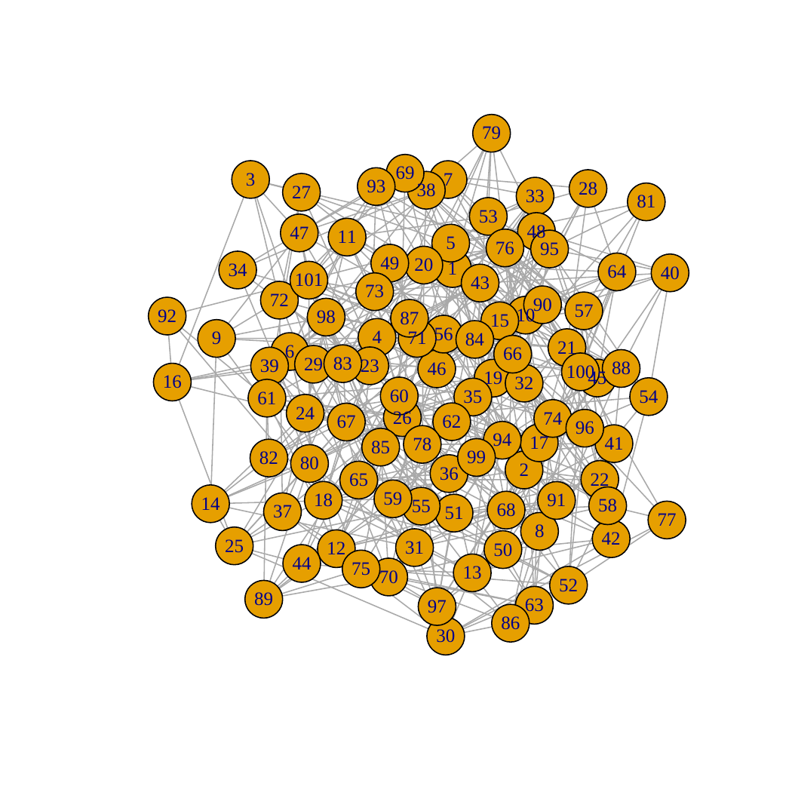

GeneNetTools
============

.. note::

   This documentation is still a work in progress.

This container includes the functions implemented in :cite:t:`2022:bernal`.

.. bibliography::
   :filter: docname in docnames

	    
Running the container::

  docker run --rm genenettools

will display the available functions in the container::

  Index:

  c_pcor_shrunk           Pcor_Shrunk
  compare.GGM             compare.GGM
  confint.GGM             confint.GGM
  corr.shrunk             corr.shrunk

The `c_` prefix in the function name stands for containerized and
receives a `JSON <https://www.json.org/json-en.html>`_ file name as a
parameter. This file must contain information such as the data file,
the parameters of the function and the output formats. Finally, the
container will stop running and the `--rm` flag will remove it.

Function documentation
----------------------

::
   
   docker run --rm genenettools c_pcor_shrunk help

::

   c_pcor_shrunk           package:GeneNetTools           R Documentation

   Pcor_Shrunk

   Description:

     Pcor_Shrunk

   Usage:

     c_pcor_shrunk(lparams)
     
   Arguments:

   lparams:

   Value:

     plot

   
Parameters in a JSON file
*************************
::
   
   {
      "filename":"testdata.csv",
      "lambda": 0.1,
      "verbose": true,
      "cutoff": 0.1
   }

Running the function
********************

::

   docker run --rm -v "$PWD:/myapp/data genenettools c_pcor_shrunk shrunk.json

Result
******

