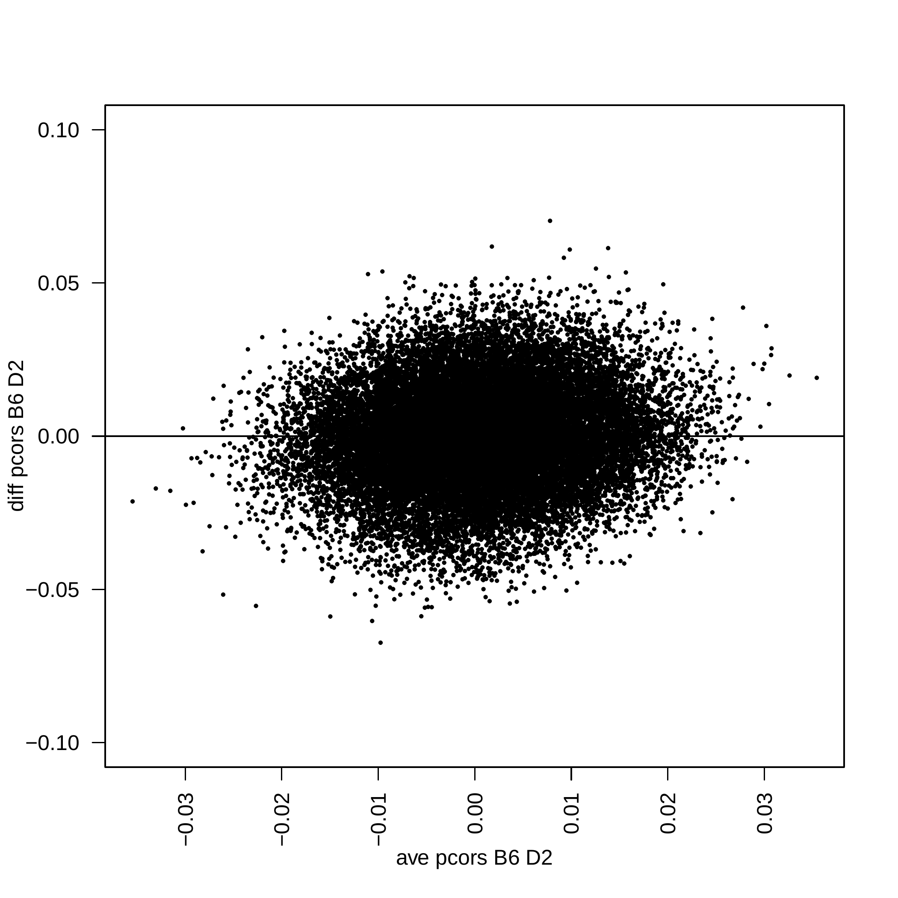

========================
 GeneNetTools container
========================

.. note::

   This documentation is still a work in progress.

The `GeneNetTools` container implements the statistical techniques
developed in :cite:t:`2022:bernal`. These implementations allow not
only to ``reproduce`` the results in the paper but also ``reuse`` the
functions with your own data ``without the need for programming
skills``. It is assumed that you have `Docker
<https://docs.docker.com/get-docker/>`_ installed.

.. bibliography::
   :filter: docname in docnames

Reproducible results
********************
	    
Figure 2 (b)
------------

#. Save the following JSON object in an ``ecoli.json`` file.
   
   ::
   
      {
        "filename":"ecoli.csv",
        "verbose": true,
        "cutoff": 0.01
	}

#. Download ``ecoli.csv`` running the command

   ::

      wget https://raw.githubusercontent.com/V-Bernal/GeneNetTools/venus/feature/container/GeneNetTools/tests/testthat/data/ecoli.csv

#. Run the command
   
   ::

      docker run --rm -v "$PWD":/app/data venustiano/cds:genenettools-0.1.0 c_pcor_shrunk ecoli.json

   Results

   ::
   
      Opening  parameters file: ecoli.json
      Reading all columns
      Number of samples =  9 
      Number of variables =  102 
      degrees of freedom k = 828.949258958985

   and the plot in ``Rplots.pdf``

   .. figure:: ../../../_static/floretplot.png-1.png
	:width: 500
	:alt: florest plot

	Escherichia coli. Forest plot of partial correlations. The 15
	strongest edges are displayed with their 95% confidence
	intervals. The vertical lines show the 0.1 and 0.3 thresholds
	for weak and mild correlations (Cohen, 1988)

Network
-------

::

   docker run --rm -v "$PWD":/app/data venustiano/cds:genenettools-0.1.0 c_pval_pcor_shrunk ecoli.json

.. figure:: ../../../_static/network.png-1.png
  :width: 500
  :alt: network
	  
  Escherichia coli microarray network analysis. The transcripts are
  represented by nodes and the significant partial correlation by
  edges, see t-test [Equation (6)].
	
Scatterplot
-----------

::

   docker run --rm -v "$PWD":/app/data venustiano/cds:genenettools-0.1.0 c_zscore_shrunk ecoli.json

	
Reusing the methods
*******************

Using your own data

Basic commands
**************
	    
Running the container::

  docker run --rm venustiano/cds:genenettools-0.1.0

will display the available functions in the container::

  Index:

  c_pcor_shrunk           Partial correlation shrunk
  c_pval_pcor_shrunk      pval_pcor_shrunk
  c_zscore_shrunk         c_zscore_shrunk
  compare.GGM             compare.GGM

The `c_` prefix in the function name stands for containerized and
receives a `JSON <https://www.json.org/json-en.html>`_ file name as a
parameter. This file must contain information such as the data file,
the parameters of the function and the output formats. Finally, the
container will stop running and the `--rm` flag will remove it.

Function documentation
~~~~~~~~~~~~~~~~~~~~~~

The ``help`` flag.

::
   
   docker run --rm venustiano/cds:genenettools-0.1.0 c_pcor_shrunk help

::

   c_pcor_shrunk          package:GeneNetTools           R Documentation

   Partial correlation shrunk

   Description:

     This function computes confidence intervals for the partial
     correlation with shrinkage.

   Usage:

     c_pcor_shrunk(lparams)
     
   Arguments:

   lparams: a list of parameters created using a JSON file. This file should
            contain the following name/value pairs.

            "filename": <string, required>

            "variables": <array, strings representing column names>

            "cutoff": <number, required threshold for the p-value of the
            partial correlation>

            "verbose": <boolean, required to display detailed description
            on the terminal>

   Value:

     Forest plot of partial correlations in Rplot.pdf

Citation
********

.. todo::

   Generate Zenodo DOI
     
GitHub
******

If you want to use the original ``GeneNetTools`` source code or
install the R package, visit the main author's `GitHub repository
<https://github.com/V-Bernal/GeneNetTools>`_.

