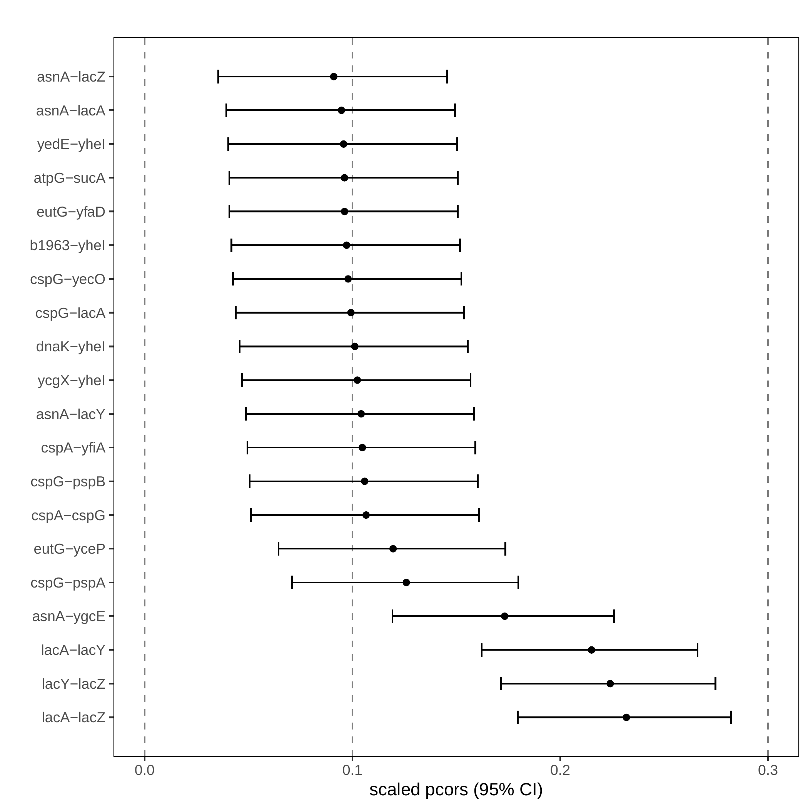

GeneNetTools
============

.. note::

   This documentation is still a work in progress.

The `GeneNetTools` container includes the functions implemented in
:cite:t:`2022:bernal`. These functions allow not only to ``reproduce``
the results in the paper but also ``reuse`` the functions with your
own data. It is assumed that you have `Docker
<https://docs.docker.com/get-docker/>`_ installed.

.. bibliography::
   :filter: docname in docnames

Reproducible
************
	    
Figure 2 (b)
++++++++++++

#. Save the following JSON object in an ``ecoli.json`` file.
   
   ::
   
      {
        "filename":"ecoli.csv",
        "verbose": true,
        "cutoff": 0.01
	}

#. Download ``ecoli.csv`` running the command

   ::

      wget https://raw.githubusercontent.com/V-Bernal/GeneNetTools/venus/feature/container/GeneNetTools/tests/testthat/data/ecoli.csv

#. Run the command
   
   ::

      docker run --rm -v "$PWD":/app/data genenettools c_pcor_shrunk ecoli.json

Results

::
   
   Opening  parameters file: ecoli.json
   Reading all columns
   Number of samples =  9 
   Number of variables =  102 
   degrees of freedom k = 828.949258958985

and the plot in ``Rplots.pdf``

Reusable
********

Using your own data

Basic commands
**************
	    
Running the container::

  docker run --rm genenettools

will display the available functions in the container::

  Index:

  c_pcor_shrunk           Pcor_Shrunk
  compare.GGM             compare.GGM
  confint.GGM             confint.GGM
  corr.shrunk             corr.shrunk

The `c_` prefix in the function name stands for containerized and
receives a `JSON <https://www.json.org/json-en.html>`_ file name as a
parameter. This file must contain information such as the data file,
the parameters of the function and the output formats. Finally, the
container will stop running and the `--rm` flag will remove it.

Function documentation
----------------------

::
   
   docker run --rm genenettools c_pcor_shrunk help

::

   c_pcor_shrunk          package:GeneNetTools           R Documentation

   c_pcor_shrunk

   Description:

     This function computes confidence intervals for the partial
     correlation with shrinkage.

   Usage:

     c_pcor_shrunk(lparams)
     
   Arguments:

   lparams: a list of parameters created using a JSON file. This file should
            contain the following name/value pairs.

            "filename": <string, required>

            "variables": <array, strings representing column names>

            "cutoff": <number, required threshold for the p-value of the
            partial correlation>

            "verbose": <boolean, required to display detailed description
            on the terminal>

   Value:

     Forest plot of partial correlations in Rplot.pdf

GitHub
******

If you want to use the original source code or install the R package,
visit the main author's `Github repository
<https://github.com/V-Bernal/GeneNetTools>`_.

