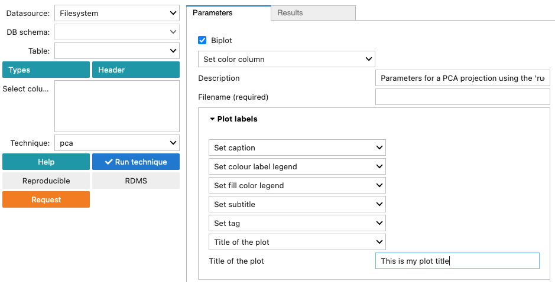
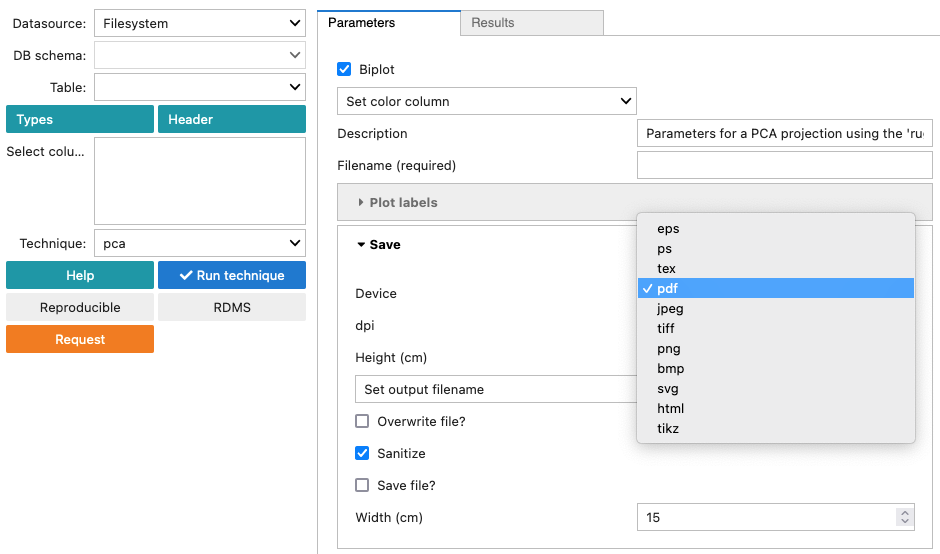
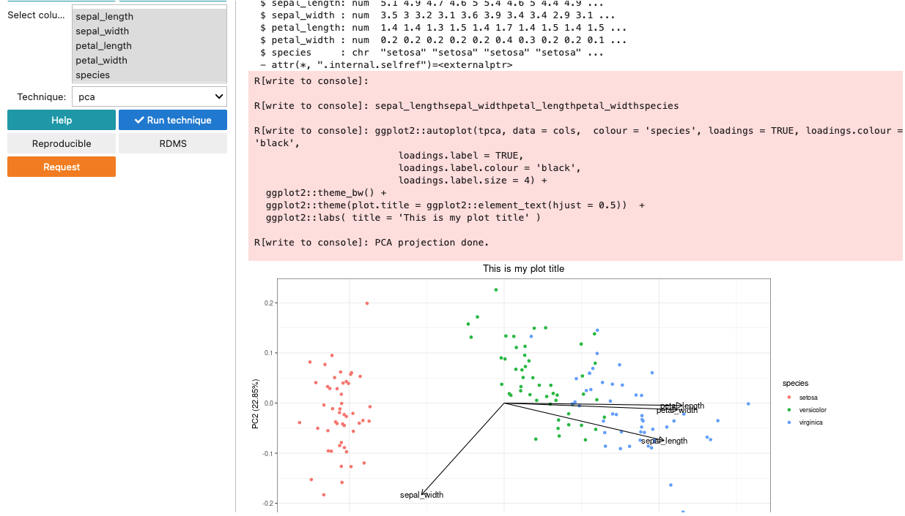

Reusable techniques: GUI
========================

The ``reusable methods GUI`` is a graphical user interface designed to
run data science techniques that receive parameters defined in a `JSON
schema <http://json-schema.org/>`_.

The screenshot below shows the main controls of the GUI.

.. figure:: _static/gui_rugplot_initial_screen.png
	       :alt: gui rugplot initial screen

When a ``Technique`` is selected in the dropdown menu a form wil be
displayed based on a predefined JSON schema.

The ``reproducible`` button is not implemented yet, but it will create
a package including, parameters, data and the command to reproduce the
results in different platforms such as Windows, MacOS and Linux.

The ``RDMS`` button will store the a package in an iRODS instance.

``rugplot`` forms
*****************

The following screnshot shows an example of a PCA form which is
defined in the ``rugplot`` package for data visualization.

.. figure:: _static/images/docs/pca_jsonschema_form.png
               :alt: PCA JSON schema form

Common rugplot ``parameters``
+++++++++++++++++++++++++++++

``Filename (required)`` is filled in automatically from the ``Table``
dropdown menu.

``Plot labels``

``Save``

``html`` creates an interactive plotly plot and ``tikz`` creates a
latex pdf plot using the TikzDevice R package

``Set variables``

These variables are taken automatically from the select columns on the
left panel.

``Results`` tab

Displays the results of running the technique

