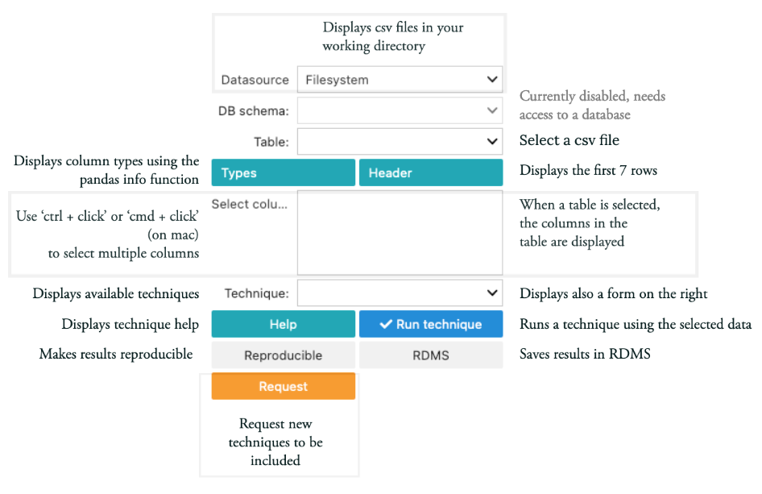

Reusable techniques: GUI
========================

The ``reusable methods GUI`` is a graphical user interface designed to
run data science techniques that receive parameters defined in a `JSON
schema <http://json-schema.org/>`_.

The screenshot below shows the main controls of the GUI.

When a ``Technique`` is selected in the dropdown menu a form wil be
displayed based on a predefined JSON schema. The following screnshot
shows an example of a PCA form which is defined in the ``rugplot``
package for data visualization.

The ``reproducible`` button is not implemented yet, but it will create a
package including, parameters, data and the command to reproduce the
results in different platforms such as Windows, MacOS and Linux.

The ``RDMS`` button will store the a package in an iRODS instance. 

