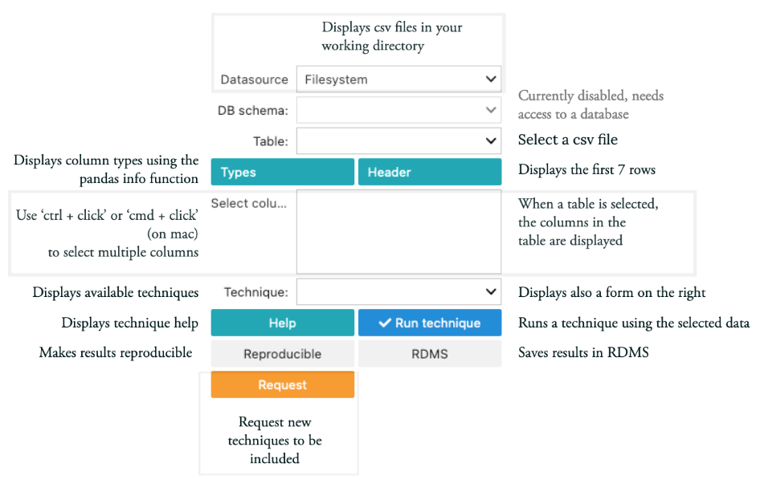

rugplot: GUI
============

rugplot GUI is a graphical user interface for the rugplot R package.

Documentation
*************

The screenshot below shows the main controls of the GUI.

Currently, there are 5 visualization techniques implemented: pca, scatterplots, histograms, PCA projections and heatmaps.

The reproducible button is not implemented yet, but it will create a package including, parameters, data and the command to reproduce the results in different platforms such as Windows, MACOS and Linux.

The RDMS button will store the a pacakage in an iRODS instance. 

.. TODO::

   Document generic jsonschema-rugplot fields.
