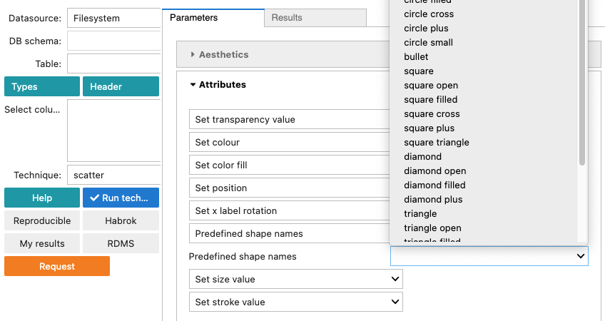

rugplot: GUI
============

The ``rugplot`` GUI is a set of forms to facilitate a user friendly
interface to create reproducible visualizations using the `rugplot
<https://github.com/rijksuniversiteit-groningen/rugplot>`_ R
package. Each of these forms display fields according to the
associated visualization technique. Based on the concept of ``The
Grammar of Graphics``, these fields can represent elements such as
``Aesthetics``, ``Attributes`` or ``Facets``. Currently, there are
five visualization techniques implemented: `PCA`, `histograms`,
`heatmaps`, `scatterplots` and `violin plots`.

As an example, the following screenshot shows on the left panel, a
`csv` file selected in the `Table` dropdown list. The `Select column`
box shows three variables selected highlighted in blue. The `Technique`
dropdown list shows that the `scatter` technique has been selected. On
the right side panel, a foldable form associated with the `scatter`
technique is displayed.

.. figure:: /_static/images/docs/scatter_iris.png
            :alt: Scatterplot form

The sections of the `scatter` form are described in the following
subsections.
		  
Aesthetics
**********
		  
``Aesthetics``, are always represented by columns in the dataset and
can be categorical or numeric variables. These `columns` can chosen
from the selected variables on the left panel. `Aesthetics` can be
different for each visualization technique, most of them are
`optional` and the `required` variables (aesthetics) are indicated as
shown below.

.. figure:: /_static/images/docs/scatter_required_params.png
            :alt: Scatterplot aesthetics

Attributes
**********
		  
``Attributes``, always represent constant values such as numbers or
strings. For example, numbers can represent `point size`, `angles` or
`transparency levels`. Strings can represent `hexadecimal colors` or
shapes like in the screenshot below.

Color manual
************

The ``Color manual`` section in the form is implemented only for
categorical variables. The categorical variable must be provided in
the colour field, aesthetics section. Three vectors must be provided,
``Breaks``, ``Labels`` and ``Color values``.

.. figure:: /_static/images/docs/color_manual.png
            :alt: Color manual section

``Breaks`` are the
categories in the categorical variable. ``Labels`` are the labels to
be displayed in the legend and ``color values`` are the colors for
each of the categories. The colors can be in hexadecimal format or in
a string format as returned by the ``colors()`` function in R. The
length of the vectors must be equal to the number of categories in the
variable.

For example, the following screenshots show how to assign colors
manually to a scatterplot using the ``iris`` dataset and the
categorical variable ``species``.

.. figure:: /_static/images/docs/Breaks.png
            :alt: Categorical breaks

.. figure:: /_static/images/docs/Labels.png
            :alt: Labels

.. figure:: /_static/images/docs/color_values.png
            :alt: Color values

Facets
******

``Facets``, splits a plot into a matrix of panels. This implementation
is based on the `facet_grid()
<https://ggplot2.tidyverse.org/reference/facet_grid.html>`_ function
from the `ggplot2 R package`. Currently, in the `rugplot`
implementation can be used with one or two discrete variables. For
example, the following screenshot shows how to use `vertical facets`
to create `scatterplot` panels using the `species` variable from the
iris dataset.

.. figure:: /_static/images/docs/scatter_vertical_facets.png
            :alt: Vertical facets

The result of using `vertical facets` is shown in the screenshot below.
  
.. figure:: /_static/images/docs/scatter_vertical_facets_result.png
            :alt: Result of vertical facets

Plot labels
***********

The ``Plot labels`` section allows to set different labels in a plot
such as title, subtitle and coordinate labels.

.. figure:: /_static/images/docs/plot_labels.png
            :alt: Plot labels

Save
****

The ``Save`` section has a number of features to save the
visualizations in different formats such as `png`, `jpeg`, `pdf` and
`html`. Two interesting formats are `html` and `tikz`. The former
option produces an interactive plot using the ``plotly`` package and
the latter produces a high quality plot in pdf using the
``TikzDevice`` R package which generates the plots using
``LaTeX``. Additionally, dimensions (height and width) and resolution
of the output (for non vector-graphics formats such as png and jpeg)
can be defined. Finally, the ``Sanitize`` flag is only used for `tikz`
plots to escape special LaTeX symbols.

.. figure:: /_static/images/docs/scatter_save.png
            :alt: Save plot in different formats

Theme, leyend Key properties
****************************

The ``Theme, leyend Key properties`` section is meant to customize the
non-data elements of the plots, for example, titles, fonts and
legends. Currently, only the ``key-size`` of the legend is
implemented. The effect of setting the `size of the key` to 7 is shown
in the following screenshot.

.. figure:: /_static/images/docs/scatter_key_size.png
            :alt: Key size effect

Column/Variable names
*********************

This section provides the columns to be used to create the
visualization. In the `rugplot:GUI` version, these columns are taken
automatically from the selected columns on the left panel.
		  
.. toctree::
   :maxdepth: 2
   :caption: Visualization techniques:

   histograms
   pca
   scatter
   violin
   heatmaps

