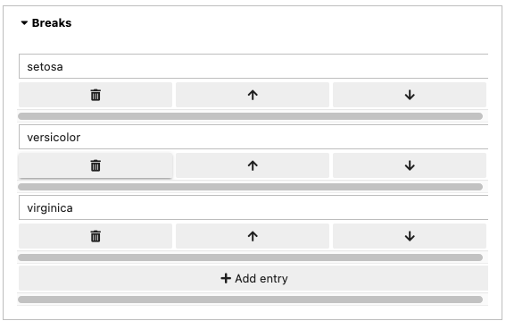

rugplot: scatterplots
=====================

The `geom_point()
<https://ggplot2.tidyverse.org/reference/geom_point.html>`_ function
from ggplot2 is used to create scatterplots.

The two required aesthetics in point geom are ``x`` and ``y``.

Aesthetic specifications can be found in the `cran
<https://cran.r-project.org/web/packages/ggplot2/vignettes/ggplot2-specs.html>`_
or `tidyverse
<https://ggplot2.tidyverse.org/articles/ggplot2-specs.html>`_
documentation.

``Column/Variable names`` is an array created automatically using the
selected variables on the left.

The ``Color manual`` section in the form is implemented only for
categorical variables. The categorical variable must be provided in
the colour field, aesthetics section. Three vectors must be provided,
``Breaks``, ``Labels`` and ``Color values``. ``Breaks`` are the
categories in the categorical variable. ``Labels`` are the labels to
be displayed in the legend and ``color values`` are the colors for
each of the categories. The colors can be in hexadecimal format or in
a string format as returned by the ``colors()`` function in R.The
length of the vectors must be equal to the number of categories in the
variable.

For example, the following screenshots show how to assign colors
manually to a scatterplot using the ``iris`` dataset and the
categorical variable ``species``.

