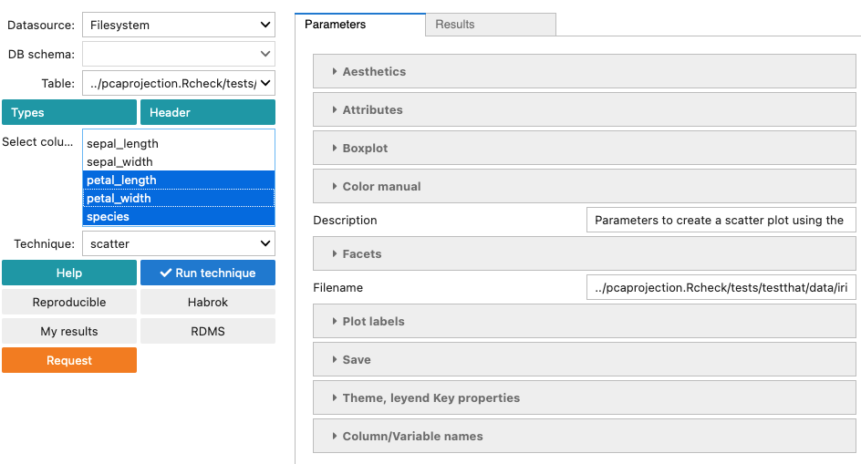

rugplot: scatterplots
=====================

Quickstart
**********

Select a csv file in the ``Table`` dropdown list, select the columns
to create the scatter plot in the ``Select columns`` box and select
``scatter`` in the ``Technique`` drop down list. In the screenshot
below, the ``iris.csv`` file has been selected and three variables. The
``scatter`` form is displayed on the right-side panel.

To create a `scatterplot` two parameters in the aesthetics section
must be provided, ``x`` and ``y``.

Finally, running the technique by clicking on the ``Run technique``
button will produce a scatterplot.

.. figure:: ../../../_static/images/docs/scatter_result.png
            :alt: Iris scatter plot

The `results` tab shows the `R` source code used to generate the plot.

`Additional documentation`
************************

The other fields in the form are optional. In particular, to create
the scatterplots, the `geom_point()
<https://ggplot2.tidyverse.org/reference/geom_point.html>`_ function
from ggplot2 is used. Thus, the ``Aestethics`` fields are based on the
`aesthetics
<https://ggplot2.tidyverse.org/reference/geom_point.html#aesthetics>`_
that `geom_point` accepts. The aesthetic specifications can be found in
the `cran
<https://cran.r-project.org/web/packages/ggplot2/vignettes/ggplot2-specs.html>`_
or `tidyverse
<https://ggplot2.tidyverse.org/articles/ggplot2-specs.html>`_
documentation.

Generic descriptions of the different sections of the form such as
``Aesthetics``, ``Attributes``, ``Color manual``, ``Facets``, ``Plot
labels``, ``Save``, ``Theme, legend Key properties`` and
``Column/Variable names`` can be found in the

- :doc:`rugplot: GUI </visualization/rugplot/gui/rugplotgui>`

section.

