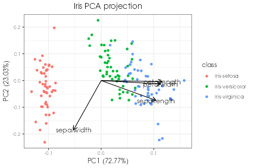

Creating visualizations with rvispack
=====================================

Assumptions
-----------

- `Docker <https://docs.docker.com/get-docker/>`_ or `Singularity
  <https://docs.sylabs.io/guides/3.5/user-guide/introduction.html>`_ are
  installed.

Basics
------

Docker
******

The command
::

   docker run --rm venustiano/cds:rvispack-0.1.0

will download the Docker image `venustiano/cds:rvispack-0.1.0` from
DockerHub if it is not in the computer host. Then it will run a
container and display information about the `R packages` used to
implement the visualizations. The `Index` section displays the current
implemented functions::

  Index:

  c_histogram             Histogram
  c_pcaproj               PCA projection
  c_violin                Violin plots

The `c_` prefix in the function name stands for containerized and
receives a `JSON <https://www.json.org/json-en.html>`_ file name as a
parameter. This file must contain information such as the data file,
the parameters of the `visualization` technique and the output
formats. Finally, the container will stop running and the `--rm` flag
will remove it.

Help
++++

The required `name/value` pairs in the JSON file can be displayed by
adding `<c_function_name> help` in the previous command, as follows::

  docker run --rm venustiano/cds:rvispack-0.1.0 c_pcaproj help

A brief description of the `name/value` pairs that could be in the
JSON file are displayed in the `Arguments` section::

  Arguments:

      lp: a list of parameters created using the `validate_json_file`
          function

          "filename": <string, required data file including more than 3
          columns>

          "variables": <array, numeric columns for applying PCA>

          "colour": <string, categorical variable to colour the
          projected points>

          "scale": <boolean, required whether to scale the selected
          variables>

          "biplot": <boolean, Display biplot (loadings)>

          "title": <string, title of the plot>

          "caption": <string, caption of the plot>

          "save": <object, composed of 'save', 'height', 'width' and
          'device'>

          "save": <boolean, whether to save the visualization or not>

          "height": <number, in cm of the output visualization file>

          "width": <number, in cm of the output visualization file>

          "device": <enum, ["eps", "ps", "tex", "pdf", "jpeg", "tiff",
          "png", "bmp", "svg"]>

	  "interactive": <boolean, save
          interactive html version>

The `names` in the JSON file are between double quotes and the
description of the `values` are between angle brackets. This
description includes the data types as defined in the `JSON
<https://www.json.org/json-en.html>`_ format. Below is an example of a
valid JSON file (`pca_iris_params.json`)::
   
   {
       "filename": "iris.csv",
       "colour": "species",
       "scale": true,
       "biplot": true,
       "title": "Iris PCA projection"
   }

JSON objects and name/value pairs
+++++++++++++++++++++++++++++++++

A JSON object is an unordered set of `name/value` pairs. An object
begins with `{` left brace and ends with `}` right brace. Each `name`
is followed by `:` colon and the `name/value` pairs are separated by
`,` comma.

`Name/value` pairs in the JSON objects are validated by means of `JSON
schemas
<https://json-schema.org/understanding-json-schema/index.html>`_. Here
will be described the essential name/value pairs to run the functions
to create visualizations using `rvispack`. See the `JSON Schema
Reference
<https://json-schema.org/understanding-json-schema/reference/index.html>`_
for additional information.

The description of the values (between<>) indicate the `type` of
`value`, namely `string`, `number`, `integer`, `object`, `array` and
`boolean`.

- The `"string"` type is used for strings of text.
- The `number` type is used for integers or floating point numbers.
- The `integer` type is used for integran numbers (no decimal point).
- The `boolean` type matches only `true` or `false`.
- The `array` type is used for ordered elements.
- The `enum` keyword is used to restrict a value to a fixed set of
  values defined in an `array`.
- The `object` type is used to map `"names"` to `"values"`. `"names"`
  must always be strings. In the arguments of the `c_pcaproj`
  function, `"save"` is a nested JSON object including 4 `name/value`
  pairs. As an example, the JSON `save` object can be defined as
  follows::

        ...
        "save":{
	    "save": true,
	    "width": 15,
	    "height": 10,
	    "device": "png"
	  }
	}

Volumes
+++++++

For the visualization functions to access the data and the JSON file,
a folder in the filesystem must be mounted in the container. A common
way to achieve this is by passing an argument like `-v
"$PWD":/app/data` in the command as follows::
   
  docker run --rm -v "$PWD":/app/data venustiano/cds:rvispack-0.1.0 c_pcaproj pca_iris_params.json

`-v` is just an abbreviation of `--volume`. The content of the working
directory (`$PWD`) including the JSON and data files will be available
in the container in the folder `/app/data`.

.. note::

   Under Windows if not using WSL, preferably use Powershell and
   change `"$PWD"` by `${PWD}`.

.. warning::

   Do not change the `/app/data` mounting point.

The result of running the previous command is the following
visualization stored in a `Rplot.pdf` file.
  

Setting `"interactive"` to `true` in `pca_iris_params.json` will
generate an interactive visualization::
  
  ...
       "title": "Iris PCA projection",
       "interative":true
   }

.. raw:: html
	 
	 <iframe src="../../_static/iris.csv-pca-20221028_074618.html" height="500px" width="100%"></iframe>
	
Singularity
***********

.. todo::

   Write documentation for running `rvispack` visualizations using singularity.
